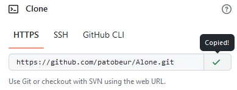
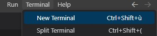
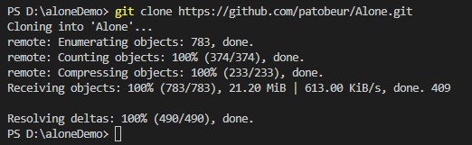
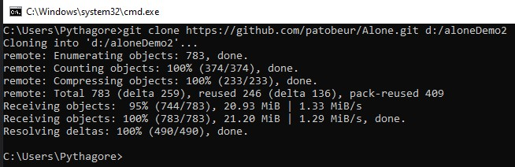
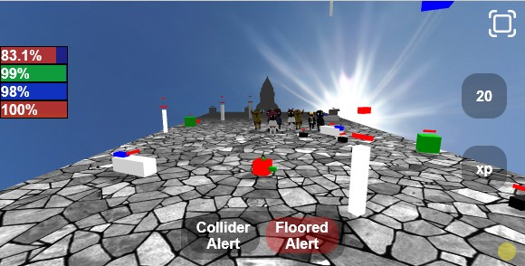

# AlOne
Experiences, tests et découvertes avec threeJs, javascript.

    Objectif faire un jeu en 3d multijoueurs.
## Installe avec [Visual Studio Code]

- Créer un dossier (par exemple : "d:\aloneDemo" )

- Récuperer le lien git sur le dépot ou celui-ci : ```https://github.com/patobeur/Alone.git```

    

- ouvrez le dossier directement dans VSCode puis ouvrez le terminal
([CTRL] + [MAJ] + [ù]): 

    


- avant de taper :
    ```git clone https://github.com/patobeur/Alone.git```

    


## Installe en ligne de commande avec cmd.exe sous W.

 - Ouvrir "invite de commandes" avec les touche [WIN] + [R]

    puis taper : ```git clone https://github.com/patobeur/Alone.git d:/votreDossier```

    

## Installe sous Xampp, Wampp.. !!
 - si vous avez un serveur comme xampp, indiquez votre dossier local : ```D:/xampp/htdocs/votreDossier``` par exemple.

taper : ```git clone https://github.com/patobeur/Alone.git D:/xampp/htdocs/votreDossier```



Testez la Demo  : https://patobeur.github.io/Alone/
